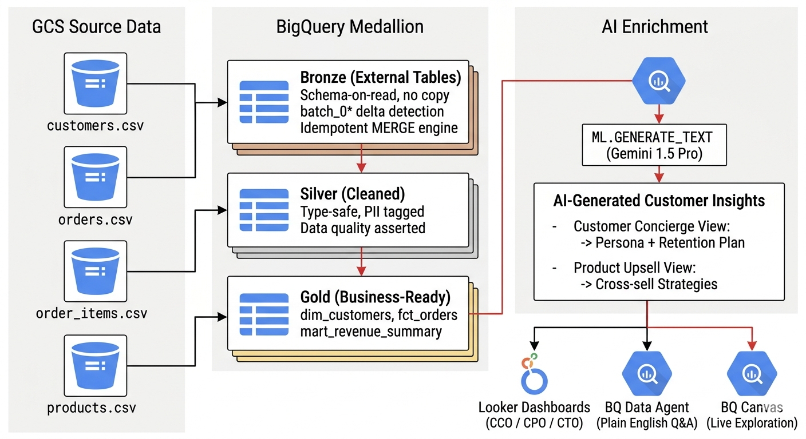

# Intelia Warehouse — Board Presentation
## "From Raw Data to AI-Powered Decisions in Minutes"
**Date**: April 2026 | **Project**: vishal-sandpit-474523 | **Prepared for**: Board of Directors

---

## The Problem We Solved

> Before this solution, answering a single C-suite question required:
> - A data analyst spending **2–5 days** pulling, cleaning, and formatting CSVs
> - No AI enrichment — decisions made on raw numbers with no contextual insight
> - Zero governance — no one knew what data was PII, what was sensitive, or whether it was fresh
> - Every new client deployment required **weeks of manual setup**

---

## What We Built

A **production-grade, AI-first data warehouse** on Google Cloud that:
- Ingests raw retail data from Google Cloud Storage automatically
- Transforms it through a governed Bronze → Silver → Gold pipeline
- Enriches every customer and product record with **Gemini AI insights**
- Delivers answers to C-suite questions **in seconds, not days**
- Deploys to any new GCP project in **under 30 minutes** by changing 4 values in a single config file

---

## Architecture at a Glance



```
GCS Source Data                 BigQuery Medallion               AI Enrichment
─────────────────               ─────────────────────            ──────────────
customers.csv        ──►  Bronze (External Tables)
orders.csv           ──►  │  Schema-on-read, no copy    ──►  Silver (Cleaned)
order_items.csv      ──►  │  Idempotent MERGE engine          │  Type-safe, PII tagged
products.csv         ──►  └─ Event-driven delta workflow       │  Data quality asserted
                                                               ▼
                                                         Gold (Business-Ready)
                                                         dim_customers, fct_orders
                                                         mart_revenue_summary
                                                               │
                                          ┌────────────────────┘
                                          │
                         ┌────────────────┴──────────────────────┐
                         │  PHASE 1 — BQ ML (product AI)         │
                         │  ML.GENERATE_TEXT (Gemini 2.5 Flash)  │
                         │  product_ai_1-4 shards → product_upsell│
                         ├───────────────────────────────────────┤
                         │  PHASE 2 — Cloud Run (customer AI)    │
                         │  BQ ML chunked: 1000 rows/job,        │
                         │  10 concurrent → customer_ai_raw      │
                         ├───────────────────────────────────────┤
                         │  PHASE 3 — Dataform (ai_aggregate)    │
                         │  customer_concierge                   │
                         │  ai_enriched_profiles                 │
                         │  mart_executive_summary_enriched      │
                         └──────────────────┬────────────────────┘
                                            │
              ┌─────────────────────────────┼──────────────────────┐
              ▼                             ▼                      ▼
        Looker Studio               BQ Data Agent           BQ Canvas
        CCO / CPO / CTO             Plain English Q&A       Live Exploration
```

---

## Time-to-Insight: Before vs After

| Stakeholder | Question | Before | After | Tool |
|------------|---------|--------|-------|------|
| **CCO** | "What is revenue vs target this month?" | 2 days (manual) | **< 3 seconds** | Looker Studio CCO Dashboard |
| **CCO** | "Why is Customer X at risk of churning?" | 1 week (analyst) | **Instant** | Gemini AI Insight column |
| **CCO** | "Show 12-month retention by customer cohort" | 3 days | **< 5 seconds** | Pre-computed Gold layer |
| **CPO** | "Which product category is growing fastest?" | 3 days (analyst) | **< 5 seconds** | Looker Studio CPO Dashboard |
| **CPO** | "What upsell strategies should we run on Product X?" | Never attempted | **Instant** | Gemini Product Upsell tile |
| **CPO** | "Are repeat or new buyers driving this category?" | 1 week | **< 5 seconds** | New vs Repeat Buyer tile |
| **CTO** | "Is our pipeline healthy right now?" | Unknown | **Real-time** | rpt_cto_dashboard — INFORMATION_SCHEMA.JOBS |
| **CTO** | "Are we compliant with data governance policy?" | Manual audit (1 week) | **Live score** | Policy tag coverage % |
| **CTO** | "Are any data quality checks failing?" | Not measured | **Live DQ score** | DQ Assertions page — Looker Studio |
| **Any** | Ad-hoc question not on a dashboard | Days (analyst ticket) | **< 1 minute** | BigQuery Data Agent |
| **Any** | Board meeting exploratory analysis | Days (PowerPoint) | **Minutes** | BigQuery Canvas |

---

## Stakeholder Value by Role

### Chief Customer Officer (CCO)
**What they get:**
- **Live Revenue Dashboard**: Gross sales vs configurable monthly target — updated with every pipeline run
- **AI Customer Profiles**: Side-by-side table where one column shows raw metrics and the next shows a Gemini-generated 2-sentence persona + specific retention strategy — for every customer
- **12-Month Cohort Retention**: Heatmap showing what % of customers from each monthly cohort are still purchasing — instantly identifies drop-off points

**The "wow" moment**: Clicking on a churning Platinum customer and seeing Gemini's retention strategy in the same row as their LTV data — no analyst required.

---

### Chief Product Officer (CPO)
**What they get:**
- **Product Revenue by Category**: Which categories are driving revenue, down to individual product level
- **Gemini Upsell Strategies**: For every product, Gemini generates two specific strategies — a cross-sell recommendation and an upsell play — powered by that product's actual sales data
- **New vs Repeat Buyer Ratio**: Which categories have loyal repeat buyers vs which are acquisition-dependent

**The "wow" moment**: Seeing Gemini recommend a specific bundle strategy for a product, grounded in real buyer data from the warehouse.

---

### Chief Technology Officer (CTO)
**What they get:**
- **Full Pipeline Visibility**: `rpt_cto_dashboard` unions three sources — every BQ job the Dataform SA ran (90-day INFORMATION_SCHEMA.JOBS), delta MERGE audit rows with row counts and timing, and live DQ assertion results
- **Data Quality Score**: 7 live assertion checks across `dim_customers`, `fct_orders`, `dim_products`, `mart_revenue_summary` — COMPLETED or ERROR with violation counts
- **Governance Compliance Score**: Live % of columns in Gold/Silver/AI datasets that have Data Catalog policy tags applied — a single number that answers "are we compliant?"
- **Delta Audit Trail**: Every GCS file drop that triggered a delta MERGE is logged in `governance.batch_audit_log` with status, row counts, duration, and run ID

**The "wow" moment**: A single dashboard showing pipeline health, data quality, and governance compliance — all refreshed automatically on every run.

---

## Non-Negotiables Delivered

| Requirement | How Delivered |
|-------------|--------------|
| **Vertex AI + ML.GENERATE_TEXT + Dataform** | Dataform manages the full pipeline; ML.GENERATE_TEXT runs Gemini 2.5 Flash inside BigQuery for customer personas (via Cloud Run BQ ML chunks) and product strategies (4 BQ ML shards) |
| **Agentic workflows** | Native BigQuery Data Agent deployed and configured for plain-English Q&A against the Gold layer |
| **Data governance: lineage, catalogue, more** | Dataform lineage DAG, Data Catalog policy tag taxonomy (PII + Financial + Internal), column-level security, delta audit logging, DQ assertion checks, schema change log |
| **CCO + CPO + CTO questions answered** | Three dedicated Looker Studio dashboards; every question from the brief answered with a named tile |
| **Terraform automation / clean architecture** | 4 values in `terraform.tfvars` deploys the entire stack (16 modules) to any new GCP project |
| **Security: no permission leaks, unused services off** | 10 service accounts with least-privilege IAM roles; PII masking via policy tags; Secret Manager for all credentials |

---

## Security & Governance Summary

| Control | Implementation |
|---------|---------------|
| Principle of least privilege | 10 service accounts — one per workload (dataform, workflows, eventarc, cloud run, dataplex, cloud build, etc.) |
| PII protection | Column-level security via Data Catalog policy tags — Analysts cannot see raw PII (`email`, `phone`, `customer_name`) |
| PII masking in AI layer | `dim_customers_analyst` — SHA-256 email, truncated phone, initialised name — used as input to all AI processing |
| Credential security | All secrets in Secret Manager — never in code or environment variables |
| Audit trail | `governance.batch_audit_log` — every delta MERGE logged with status, row counts, timing |
| DQ assertions | 7 live checks on Gold tables — uniqueKey + nonNull across `dim_customers`, `fct_orders`, `dim_products`, `mart_revenue_summary` |
| Cost governance | Budget alerts at 80% and 100% of monthly threshold |
| Data freshness SLA | Cloud Monitoring alert fires if Gold layer not refreshed within configured window |
| Schema evolution | `governance.schema_change_log` — new columns, type changes, and removals detected and logged |
| Delta idempotency | Every batch checked against `governance.batch_audit_log` before running — no duplicate processing |

---

## Client Pitch

> **"We deploy a production-grade AI data warehouse in your GCP project in under 30 minutes.**
>
> Your C-suite gets live answers to revenue, retention, product, and platform questions —
> enriched by Gemini 2.5 Flash — from a single dashboard.
>
> No analysts in the loop. No data engineering sprints. No permission leaks.
> Full governance. Fully automated.
>
> Change four values. Deploy. Done."**

---

## Deployment: 5 Steps, ~30 Minutes

```bash
# 1. Clone the repository
git clone https://github.com/chtsalvishal/Hackathon---GENAI-Comp-2
cd Hackathon---GENAI-Comp-2

# 2. Edit the ONLY file you need to change
#    Set: project_id, region, billing_account_id, github_app_installation_id
vim terraform/terraform.tfvars

# 3. Authenticate and build the Cloud Run image
gcloud auth login && gcloud auth application-default login
gcloud builds submit \
  --tag gcr.io/{YOUR_PROJECT_ID}/customer-ai-processor:latest \
  cloudrun/customer_ai/

# 4. Deploy all infrastructure (16 Terraform modules)
cd terraform && terraform init && terraform apply

# 5. Set GitHub token and run the first pipeline
echo -n "ghp_yourtoken" | gcloud secrets versions add github-token --data-file=-
gcloud workflows run daily-refresh-workflow --location={YOUR_REGION} --data='{}'
```

---

*Architecture: BigQuery Medallion (Bronze/Silver/Gold/AI/Governance) + Gemini 2.5 Flash (ML.GENERATE_TEXT) + Cloud Run BQ ML orchestration + Dataform + Looker Studio + BigQuery Canvas + Data Catalog*
*Infrastructure: Terraform (16 modules, single-tfvars deployment) | Security: 10 service accounts, Secret Manager, Policy Tags, Column-level security*
